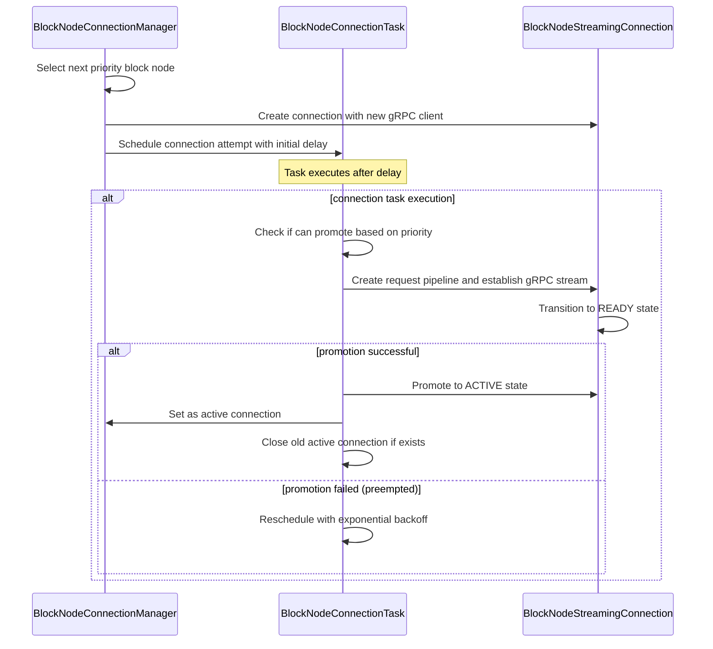
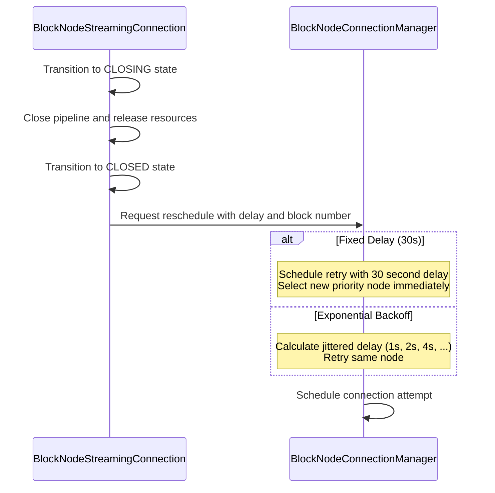
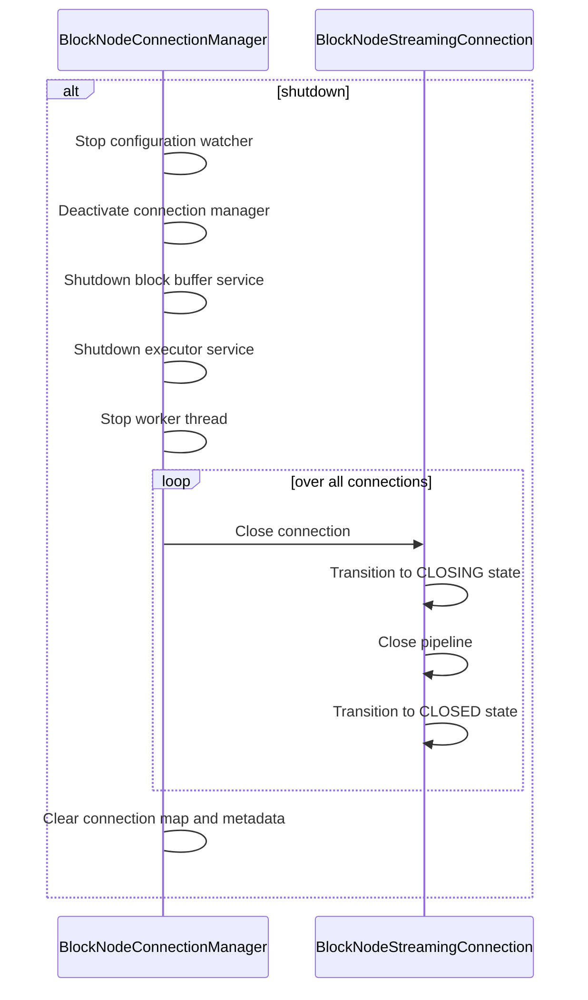

# Internal Design Document for BlockNodeConnectionManager

## Table of Contents

1. [Abstract](#abstract)
2. [Definitions](#definitions)
3. [Component Responsibilities](#component-responsibilities)
4. [Component Interaction](#component-interaction)
5. [Sequence Diagrams](#sequence-diagrams)
6. [Error Handling](#error-handling)

## Abstract

This document describes the internal design and responsibilities of the `BlockNodeConnectionManager` class.
This component manages active connections, handling connection lifecycle, and coordinating
with individual connection instances. There should be only one active connection at a time.
The class also interacts with the `BlockBufferService` to retrieve blocks/requests and notify the buffer of acknowledged
blocks.

## Definitions

<dl>
<dt>BlockNodeConnectionManager</dt>
<dd>The class responsible for managing and tracking all active block node connections, including creation, teardown, and error recovery.</dd>

<dt>BlockNodeStreamingConnection</dt>
<dd>A single connection to a block node that is used to stream blocks, managed by the connection manager.</dd>

<dt>BlockNodeServiceConnection</dt>
<dd>A single connection to a block node that is used to retrieve information about the node, managed by the connection manager.</dd>

<dt>BlockBufferService</dt>
<dd>The component responsible for maintaining a buffer of blocks produced by the consensus node.</dd>

<dt>Connection Lifecycle</dt>
<dd>The phases a connection undergoes.</dd>

<dt>RetryState</dt>
<dd>Tracks retry attempts and last retry time for each block node configuration. Persists across individual connection instances to maintain proper exponential backoff behavior.</dd>

<dt>BlockNodeStats</dt>
<dd>Maintains health and performance metrics for each block node including EndOfStream counts, block acknowledgement latency, and consecutive high-latency events.</dd>

<dt>BlockNodeConfigService</dt>
<dd>Service that monitors changes to the block-nodes.json file so new configurations can be dynamically loaded</dd>

<dt>Priority-based Selection</dt>
<dd>Algorithm for selecting the next block node to connect to based on configured priority values. Lower priority numbers indicate higher preference.</dd>
</dl>

## Component Responsibilities

- Maintain a registry of active connection instances.
- Select the most appropriate connection for streaming blocks based on priority.
- Remove or replace failed connections.
- Support lifecycle control and dynamic configuration updates.

## Component Interaction

- Maintains a bidirectional association with each connection.
- Calls `BlockBufferService` to get the blocks/requests to send and to also notify the buffer when blocks are acknowledged.
- Updates connection state and retry schedule based on feedback from connections.

## Connection Monitor and Block Node Selection

The connection manager uses a pull-based connection monitor to determine if and when a new block node streaming connection
should be established. Periodically (as controlled by the `blockNode.connectionMonitorCheckIntervalMillis` configuration)
the monitor will check the following inputs:
- Is there no primary active streaming connection?
- Is there a new configuration that needs to be applied?
- Is the block buffer at an action stage?
- The action stage is the level at which the buffer saturation is elevated and we want to take preemptive measures
before the buffer fills entirely and becomes fully saturated (at which point back pressure is enabled).
- Is there a higher priority block node available than the current one we are streaming to?
- Is the primary active streaming connection stalled?
- As part of the connection monitor, the active connection's last heartbeat (i.e. the last time the connection attempted
to do any work) will be compared against the current time. If the duration between these times is above the stall
detection threshold (managed by `blockNode.connectionStallThresholdMillis`) then the connection is considered stalled.
- Is the primary active streaming connection ready to be auto-reset?
- The auto-reset is process where a healthy connection is periodically reset (e.g. every 24 hours)

If any of these are true, then the monitor will begin the process of selecting a new block node to stream to after closing
the existing primary connection, if one exists. However, to avoid too frequent of connection switching, a global cool down
period is used. This cool down, in the simplest terms, is just a time in the future (managed by `blockNode.globalCoolDownSeconds`)
tha is the earliest we can switch connections again. For example, if this time is 30 seconds then it means at most we
can switch connection once per every 30 seconds. Note: This global cool down period will be overruled when there is no
active primary connection.

If a new connection is being forced (e.g. no active primary connection) or otherwise required, then the active primary
connection will be closed at the next block boundary. After this, based on the configuration in `block-nodes.json` a
set of block nodes will be selected for streaming and the best candidate will be chosen. Aside from what entries exist
in the `block-node.json` file, past connection history can influence whether a block node can be retried quickly.

When a connection is closed, a close reason is associated with the event. Some close reasons, such as those related to
connection errors or a block node being too far behind, will cause the associated block node to itself enter a cool down
period. This cool down period is similar to the previously mentioned global cool down that prevents reconnecting too
frequently, but it is scoped to just a specific block node. Depending on the close reason, a basic or an extended cool
down period may be used. These periods are configured by `blockNode.basicNodeCoolDownSeconds` and
`blockNode.extendedNodeCoolDownSeconds`, respectively.

Thus, for selecting which block node to connect to, we first read which block nodes are configured in the `block-nodes.json`
file and then filter out block nodes that are in a cool down. Once a set of candidates nodes is chosen, these nodes are
grouped by configured priority (lower number = higher priority), and each group is evaluated in ascending priority order.

For each node in a priority group, a service connection is used to retrieve status (`lastAvailableBlock`). For each
reachable node, the manager derives:

- `wantedBlock = lastAvailableBlock + 1` (or `-1` if the block node reports `-1`)
- whether the node is in range for immediate streaming based on CN buffer range

Filtering and candidate classification:

- Unreachable/timed-out nodes are excluded.
- Nodes with `wantedBlock < earliestAvailableBlock` are excluded (CN no longer has those blocks).
- If CN has no buffered blocks (`latestAvailableBlock == -1`), all reachable nodes are considered immediately eligible.
- For CNs with buffered blocks:
  - **In-range candidate**: `wantedBlock <= latestAvailableBlock`
  - **Ahead candidate**: `wantedBlock > latestAvailableBlock`

Selection algorithm (cross-priority):

1. Evaluate priority groups in ascending order.
2. If a group has any **in-range** candidates, select randomly from those in-range candidates and stop.
3. If a group has only **ahead** candidates, do not select yet; track that group's lowest `wantedBlock` candidates.
4. Continue evaluating subsequent priority groups.
5. If no in-range candidates are found in any group, select from the **global lowest `wantedBlock`** across all ahead-only
   groups.
6. If multiple nodes are tied at that global lowest `wantedBlock`, select randomly among the tied nodes.

This ensures we prefer immediate streamability first, while still making forward progress by selecting the "oldest"
ahead node when every group is ahead.

If no viable node is found at all, no connection is established. The selection process is retried later while the
buffer service remains active.

## Sequence Diagrams

### Connection Establishment

### Connection Error and Retry

### Shutdown Lifecycle

## Error Handling

- Detects and cleans up errored or stalled connections.
- If `getLastVerifiedBlock()` or other state is unavailable, logs warnings and may skip the connection.
